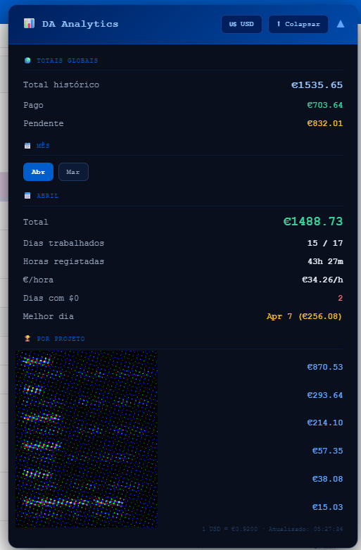

# DataAnnotation Analytics Dashboard

A Tampermonkey userscript that injects a financial analytics panel into the DataAnnotation payments page, giving you stats that the platform doesn't show.

## Features

Automatically navigates to Funds History, clicks "Include paid", and expands all entries before parsing. The panel shows:

- Monthly earnings, hours logged, and hourly rate
- Days worked vs days missed
- Best earning day
- Earnings by project (grouped and cleaned up)
- Last week summary
- Global totals with paid vs pending breakdown
- USD/EUR toggle with live exchange rate (frankfurter.app)
- Collapse button to fold everything back

## Installation

1. Install the [Tampermonkey](https://www.tampermonkey.net/) browser extension
2. Click **Create new script**
3. Delete the default content and paste the contents of `da-analytics.user.js`
4. Save with `Ctrl+S`
5. Go to `https://app.dataannotation.tech/workers/payments`

The panel will appear in the top-right corner and load automatically.

## Notes

The script reads data directly from the DOM, so it only works when the page is fully loaded. If totals look off, use the collapse button and let it re-expand everything.

Projects are grouped by name (Kernel, Achilles, Styx, Thalia, Metis, Andesite, Pegasus). Surveys, qualifications, training tasks, and onboarding steps are grouped under "DataAnnotation Survey".
