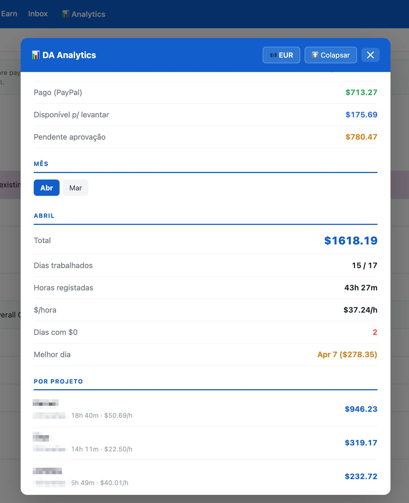

# DataAnnotation Analytics Dashboard

A Tampermonkey userscript that injects an analytics button into the DataAnnotation payments page, providing a full financial dashboard with historical tracking, monthly breakdowns, and payout analysis.

## Features

Click the 📊 Analytics button in the navbar to open the dashboard.

The script automatically:
- Navigates to **Funds History**
- Enables **"Include paid"**
- Sets pagination to **500 rows**
- Expands all days and projects
- Parses and merges data (DOM + remote + fallback)

---

## Dashboard Overview

### **Global totals**
- Total historical earnings
- Paid out by DataAnnotation
- Received in Wise (EUR tracking)
- Available to withdraw (Transferrable)
- Pending approval
- Estimated next withdrawal in EUR (live rate + PayPal spread)

---

### **Monthly view (with selector)**

Each month includes:

- Total earnings
- Days worked vs total days
- Total hours logged
- Effective hourly rate
- Best earning day

#### **Heatmap**
- Visual calendar of daily earnings
- Color intensity based on revenue
- Hover shows:
  - Earnings
  - Time worked
- Highlights current day

#### **Projects breakdown**
- Top 3 projects shown by default
- Expandable full list
- Per project:
  - Total earned
  - Number of tasks
  - Time logged
  - Hourly rate

---

### **Payments tracking (PayPal → Wise)**

- Manual + automatic payment tracking
- Stores:
  - Date
  - USD (DataAnnotation)
  - EUR received (Wise)
  - Exchange rate
- Auto-fetch historical FX rate per date
- Applies PayPal spread (~2.83%) for estimation
- Edit / delete entries
- Synced locally + remote backup

---

### **Other features**

- Live USD → EUR exchange rate (Frankfurter API)
- Remote data persistence (backup of parsed days + payments)
- Fallback data support (ensures no empty states)
- Collapse button (restores page to original state)
- Fast re-open (cached data)

---

## Installation

1. Install the [Tampermonkey](https://www.tampermonkey.net/) extension
2. Click **Create new script**
3. Replace the default code with `da-analytics.user.js`
4. Save (`Ctrl+S`)
5. Open:  
   `https://app.dataannotation.tech/workers/payments`
6. Click **📊 Analytics**

---

## Data Handling

The script combines multiple sources:

- **DOM data** (live from DataAnnotation)
- **Remote storage** (persistent history)
- **Fallback data** (safety layer)

This ensures:
- No data loss between sessions
- Historical continuity
- Faster loading after first run

---

## Project Grouping Logic

Projects are normalized and grouped automatically:

- Core projects:  
  `Kernel`, `Achilles`, `Styx`, `Thalia`, `Metis`, `Andesite`, `Pegasus`, `Argon`

- Everything matching:
  - Surveys
  - Qualifications
  - Training
  - Onboarding  

→ grouped under **"DataAnnotation Survey"**

---

## Limitations

- Hourly rate requires time entries  
  (e.g. *Rate & Review* may show no rate)
- Depends on current DOM structure of DataAnnotation
- PayPal spread is estimated (not exact)

---

## Screenshot

